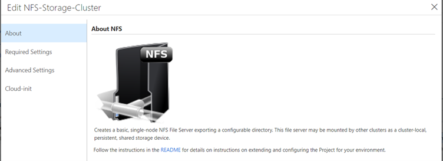
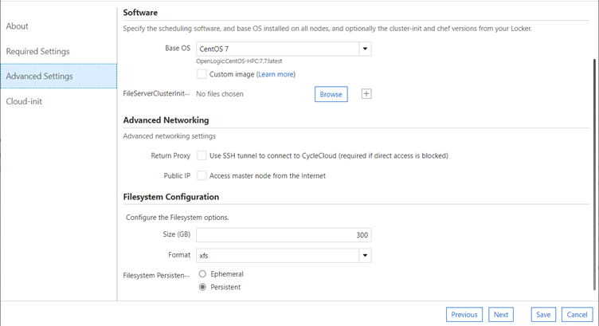
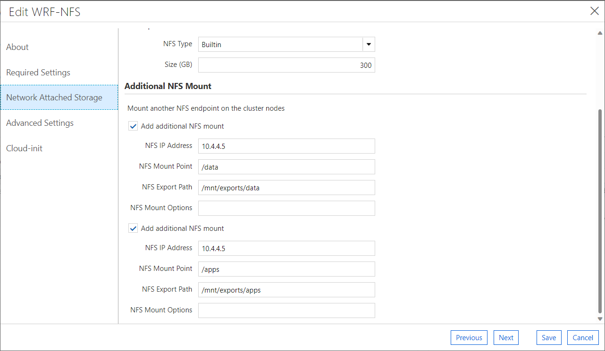
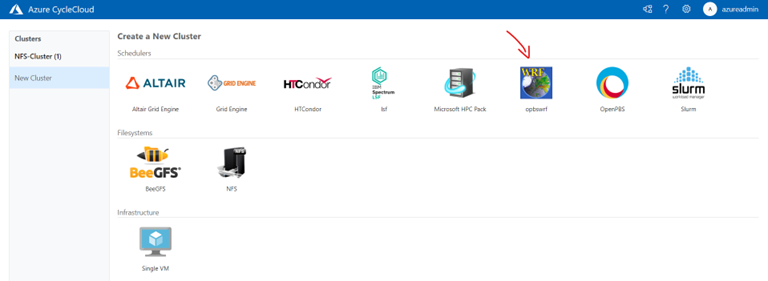
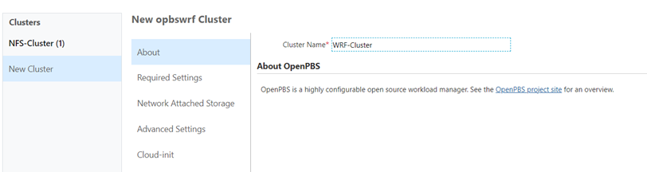
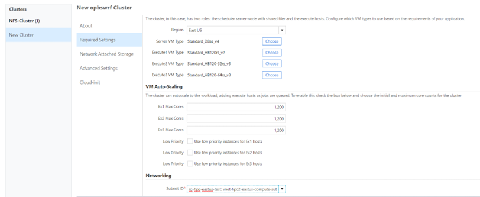
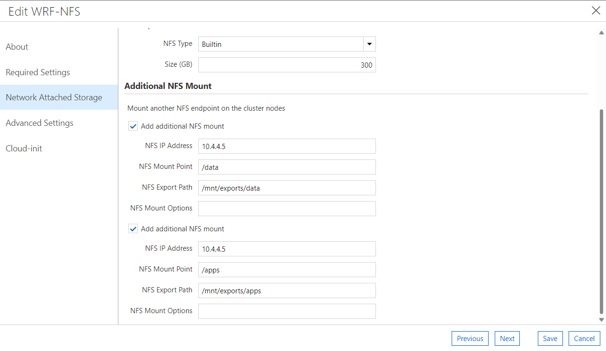
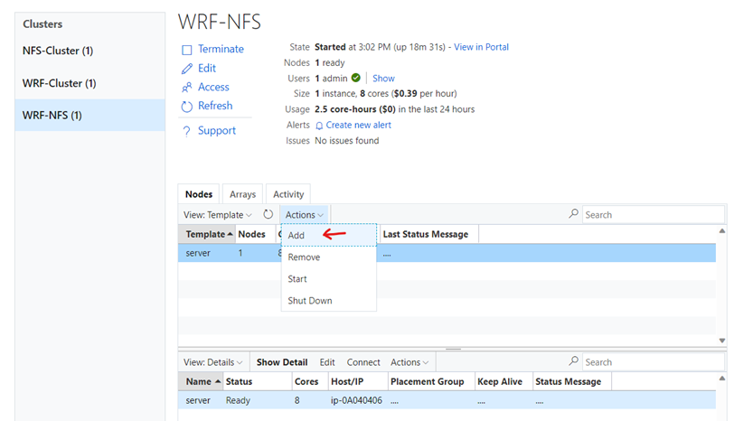
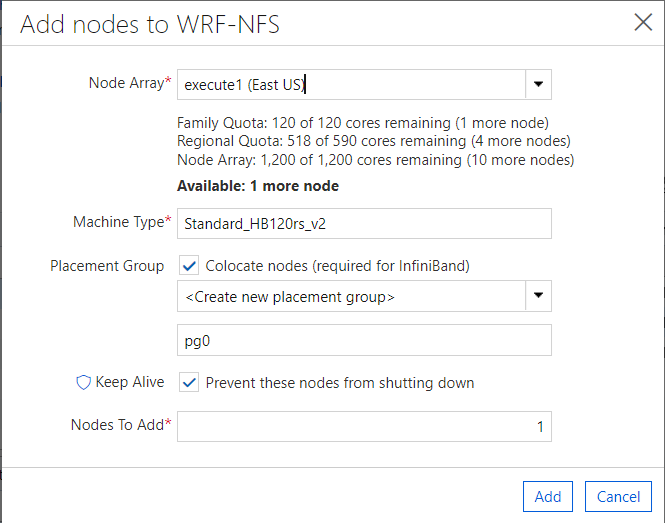

# Install and run WRF v4 and WPS v4 - Setup guide

Summary of this procedure:
- Installs CycleCloud environment from scratch
- Creates NFS storage server using CycleCloud cluster template
- Installs WRF/WPS v4 software (via “azurehpc” scripts)
- Submit jobs to run WRF v4 application for testing
  
## Prerequisites

- As this procedure uses HBv2 VMs to run WRFv4 simulations, you may need to request quota increase for this type of SKU in the subscription and region you will deploy the environment. 


## Install Azure CycleCloud

Follow the steps to [Install and Setup CycleCloud](../../tutorials/cyclecloud/install-cyclecloud.md)
 
 
## Create NFS Storage cluster
-	It can be possible to include an external NFS share at this point (in the example, I have shared from an NFS cluster using on CycleCloud template)





Changes:
- Change OS to use CentOS 7 versions
- Use +300GB storage size (space to download WRF data)
- Change cloud-init as following:
- Confirm the IP address of your NFS storage and change it below accordingly:

```
#!/bin/bash

set -x
yum install -y epel-release
yum install -y Lmod at
systemctl enable --now atd.service
cat <<EOF>/mnt/exportfs.sh
#!/bin/bash
set -x
mkdir -p /mnt/exports/data /mnt/exports/apps
sudo exportfs -o rw,sync,no_root_squash 10.4.0.0/20:/mnt/exports/data
sudo exportfs -o rw,sync,no_root_squash 10.4.0.0/20:/mnt/exports/apps
EOF
chmod 755 /mnt/exportfs.sh
at now + 2 minute -f /mnt/exportfs.sh
```

Connect to NFS storage cluster and check the mounts are correct:
```
# check mount
sudo exportfs -s
```

## Setup WRF cluster using HBv2 VM
Summary of steps:
-	Start NFS storage cluster on CycleCloud
-	Import WRF cluster template (from “azurehpc” scripts) 
-	Start WRF cluster using HBv2 VM 
-	Install WRF/WPS 4 software (from “azurehpc” scripts) 
-	Download data for WRF 4
-	Edit data locations in WRF config files
-	Generate WRF 4 input files, change permissions
-	Run WRF 4  applications for testing


### Import custom CycleCloud template for WRF

After start NFS storage cluster, ssh to it and download azurehpc GitHub repository
```
## Download azurehpc GitHub repository
cd /data
#git clone https://github.com/Azure/azurehpc.git
git clone https://github.com/marcusgaspar/azurehpc.git
```

Follow the procedures [here](https://docs.microsoft.com/en-us/azure/cyclecloud/tutorials/modify-cluster-template?view=cyclecloud-8#import-the-new-cluster-template) to upload the Cycle Cloud custom template created for WRF.
Use the template: [opbswrf-template.txt](opbswrf-template.txt) 
```
## Import CycleCloud template
cd /data/azurehpc/apps/wrf/
cyclecloud import_template opbswrf -f opbswrf-template.txt --force
``` 
After you import the template, you will see the WRF template in CycleCloud Portal:



### Create new WRF cluster
Choose the WRF Cluster name:


Choose the SKUs you want use for testing and the subnet for the compute VMs:


Check **Additional NFS Mount** options and change to the correct NFS IP address, related to your environment. Don’t need to change NFS Mount Point and NFS Export Path


Keep the default value for the other parameters, save it and start the cluster.

### Spin Execute Node with HBv2
After the cluster is up and running, start a worker node using HBv2 VM:


Click Add.

### Install WRF/WPS 4 software (via “azurehpc” scripts)

Ssh to the Execute Node (HBv2 VM) and run the following commands:

**Important 1**: You must have the /apps and /data volumes correctly mounted on head and worker nodes. It is required for WRF setup scripts.

**Important 2**: You need to be root user to run all commands below.
```
# need to be root user for building everything
sudo su -   

###### Setup Spack
cd /data/azurehpc/apps/spack
./build_spack.sh hbv2
source /apps/spack/0.16.0/spack/share/spack/setup-env.sh

###### Setup WRF
# MPI_TYPE : openmpi or mvapich2
# SKU_TYPE : hb, hbv2, hc

# This procedure uses openmpi and hbv2
cd /data/azurehpc/apps/wrf/
./build_wrf.sh openmpi hbv2
./build_wps.sh openmpi hbv2
```

Create the env-variables file:
```
###### Source Variables
cd /data/azurehpc/apps/wrf
vi env-variables
```
And copy the content below to this file and save it:
```
SKU_TYPE=hbv2
#INPUTDIR=/data/wrfdata
INPUTDIR=/apps/${SKU_TYPE}/wrf-openmpi/WRF-4.1.5/run
SHARED_APP=${SHARED_APP:-/apps}
if [ -z $INPUTDIR ]; then
    echo "INPUTDIR parameter is required"
    exit 1
fi
if ! rpm -q python3; then
    sudo yum install -y python3
fi
source /etc/profile.d/modules.sh
export MODULEPATH=${SHARED_APP}/modulefiles/${SKU_TYPE}:$MODULEPATH
module use ${SHARED_APP}/modulefiles
module load spack/spack
source $SPACK_SETUP_ENV
spack load netcdf-fortran^openmpi
spack load hdf5^openmpi
spack load perl
module use /usr/share/Modules/modulefiles
module load mpi/openmpi-4.1.0
module load gcc-9.2.0
module load wrf/4.1.5-openmpi
mpi_options="-x LD_LIBRARY_PATH "
if [ -n $LD_PRELOAD ]; then
    mpi_options+="-x LD_PRELOAD"
fi
```
Run the command:
```
# Keep as root
#sudo su -
source /data/azurehpc/apps/wrf/env-variables
```

### Download WFR Input DATA (new_conus2.5km)
WPS (WRF preprocessing system) is used to create WRF input cases. WRF v3 models are not compatible with WRF v4, so some WRF v4 input cases will need to be generated with WPS v4.
I will outline the procedure used to create a new_conus2.5km input case for WRF v4.
 
References: 
- [azurehpc/apps/wrf](https://www2.mmm.ucar.edu/wrf/users/download/get_sources_wps_geog.html)
- [Static data downloads from ucar.edu](https://www2.mmm.ucar.edu/wrf/users/download/get_sources_wps_geog.html)

Run the commands below to download WPS v4 geopraphical static data for WPS v4:
```
# Keep as root
#sudo su -

mkdir /data/wrfdata
cd /data/wrfdata
git clone https://github.com/akirakyle/WRF_benchmarks.git
wget https://www2.mmm.ucar.edu/wrf/src/wps_files/topo_10m.tar.bz2
wget https://www2.mmm.ucar.edu/wrf/src/wps_files/topo_2m.tar.bz2
wget https://www2.mmm.ucar.edu/wrf/src/wps_files/topo_30s.tar.bz2
wget https://www2.mmm.ucar.edu/wrf/src/wps_files/albedo_modis.tar.bz2
wget https://www2.mmm.ucar.edu/wrf/src/wps_files/maxsnowalb_modis.tar.bz2
wget https://www2.mmm.ucar.edu/wrf/src/wps_files/topo_gmted2010_30s.tar.bz2
wget https://www2.mmm.ucar.edu/wrf/src/wps_files/modis_landuse_20class_30s_with_lakes.tar.bz2
wget https://www2.mmm.ucar.edu/wrf/src/wps_files/soiltemp_1deg.tar.bz2
wget https://www2.mmm.ucar.edu/wrf/src/wps_files/soiltype_top_30s.tar.bz2
wget https://www2.mmm.ucar.edu/wrf/src/wps_files/soiltype_bot_30s.tar.bz2
wget https://www2.mmm.ucar.edu/wrf/src/wps_files/greenfrac_fpar_modis.tar.bz2
wget https://www2.mmm.ucar.edu/wrf/src/wps_files/lai_modis_10m.tar.bz2
wget https://www2.mmm.ucar.edu/wrf/src/wps_files/orogwd_10m.tar.bz2

tar xjvf topo_10m.tar.bz2
tar xjvf topo_2m.tar.bz2
tar xjvf topo_30s.tar.bz2
tar xjvf albedo_modis.tar.bz2
tar xjvf maxsnowalb_modis.tar.bz2
tar xjvf topo_gmted2010_30s.tar.bz2
tar xjvf modis_landuse_20class_30s_with_lakes.tar.bz2
tar xjvf soiltemp_1deg.tar.bz2
tar xjvf soiltype_top_30s.tar.bz2
tar xjvf soiltype_bot_30s.tar.bz2
tar xjvf greenfrac_fpar_modis.tar.bz2
tar xjvf lai_modis_10m.tar.bz2
tar xjvf orogwd_10m.tar.bz2
```

Download the data from https://rda.ucar.edu/datasets/ds084.1/
1) Register to the site and go to the "Data Access" section and download the following data:
2) Data Access > Web File Listing > Complete File List > 2018 > 2018-06-17 
3) Select:  from gfs.0p25.2018061700.f000.grib2 to gfs.0p25.2018061712.f384.grib2 (93 files around 20GB)
4) Select Python Download Script and upload it to the worker VM as download_gfs_files.py.

Run the commands and be sure of copying the download_gfs_files.py the folder below:
```
# Keep as root
#sudo su -

mkdir /data/wrfdata/gfs_files
cd /data/wrfdata/gfs_files
python download_gfs_files.py <password used to register in rda site>

# grant permission to users that will run the WRF to access the files. 
chown -R azureadmin:cyclecloud /data
chown -R azureadmin:cyclecloud /apps
```

### Generate WRF4 Input Files
Modify your **namelist.wps** file, setting the correct paths for **geog_data_path**, **opt_geogrid_tbl_path** and **opt_metgrid_tbl_path**:
```
# Keep as root
#sudo su -

#### Change Data Locations
cd /apps/hbv2/wps-openmpi/WPS-4.1
cp namelist.wps namelist.wps.old
cp /data/wrfdata/WRF_benchmarks/cases/new_conus2.5km/namelist.wps namelist.wps

vi /apps/hbv2/wps-openmpi/WPS-4.1/namelist.wps
 geog_data_path = '/data/wrfdata/',
 opt_geogrid_tbl_path = '/apps/hbv2/wps-openmpi/WPS-4.1/geogrid/',
 opt_metgrid_tbl_path = '/apps/hbv2/wps-openmpi/WPS-4.1/metgrid/',
```

### Run Applications: 

#### Run geogrid.exe and metgrid.exe
```
# Keep as root
sudo su -

# Source variables
source /data/azurehpc/apps/wrf/env-variables

#### Run geogrid.exe 
cd /apps/hbv2/wps-openmpi/WPS-4.1/
mpirun --allow-run-as-root ./geogrid.exe
ln -s ungrib/Variable_Tables/Vtable.GFS Vtable
./link_grib.csh /data/wrfdata/gfs_files/gfs.0p25.20180617*
./ungrib.exe >& ungrib.log

#### Run metgrid.exe
mpirun --allow-run-as-root ./metgrid.exe
```

Expected results 1: 
``` 
# !  Successful completion of metgrid.  ! 
# You may receive also some warnings: 
Note: The following floating-point exceptions are signalling: IEEE_OVERFLOW_FLAG IEEE_UNDERFLOW_FLAG IEEE_DENORMAL
``` 
Expected results 2: 
You will find the files below:
``` 
ls -l *met_em.d*
# Should see the following files:
# met_em.d01.2018-06-17_12:00:00.nc
# met_em.d01.2018-06-17_09:00:00.nc
# met_em.d01.2018-06-17_06:00:00.nc
# met_em.d01.2018-06-17_03:00:00.nc
# met_em.d01.2018-06-17_00:00:00.nc
```

#### Run real.exe
``` 
# Keep as root
sudo su -

cd /apps/hbv2/wrf-openmpi/WRF-4.1.5/run
cp -f namelist.input namelist.input.old
cp -f /data/wrfdata/WRF_benchmarks/cases/new_conus2.5km/namelist.input .
cp /apps/hbv2/wps-openmpi/WPS-4.1/met_em.d0*.nc .
mpirun --allow-run-as-root ./real.exe
```

Expected results: 
The following files should be generated in /apps/hbv2/wrf-openmpi/WRF-4.1.5/run/
- wrfbdy_d01
- wrfinput_d01
```
ls -l /apps/hbv2/wrf-openmpi/WRF-4.1.5/run/*_d0*
```

#### Change Permissions on Files
```
# grant permission to users that will run the WRF to access the files. 
chown -R azureadmin:cyclecloud /data
chown -R azureadmin:cyclecloud /apps
```

Once you get here, you completed the WRF v4 setup!
Now you can shutdown and terminate the HBv2 worker node used to perform these setup procedures.

## Running and Testing

Connect to head node of WRF Cluster and submit WRF v4 simulation job:

> Where SKU_TYPE is the sku type you are running on and INPUTDIR contains the location of wrf input files (namelist.input, wrfbdy_d01 and wrfinput_d01)

- Test 1 
  - SKU: Standard_HB120rs_v2
  - User: azureadmin
  - Nodes: 1 
  - Processes per node: 60 
  - MPI processes per node: 30 
```
mkdir ~/test1
cd ~/teste1

qsub -l select=1:nodearray=execute1:ncpus=60:mpiprocs=30,place=scatter:excl -v "SKU_TYPE=hbv2,INPUTDIR=/apps/hbv2/wrf-openmpi/WRF-4.1.5/run" /data/azurehpc/apps/wrf/run_wrf_openmpi.pbs
```

- Test 2 
  - SKU: Standard_HB120rs_v2
  - User: azureadmin
  - Nodes: 2 
  - Processes per node: 60 
  - MPI processes per node: 30 
```
mkdir ~/test2
cd ~/teste2

qsub -l select=2:nodearray=execute1:ncpus=60:mpiprocs=60,place=scatter:excl -v "SKU_TYPE=hbv2,INPUTDIR=/apps/hbv2/wrf-openmpi/WRF-4.1.5/run" /data/azurehpc/apps/wrf/run_wrf_openmpi.pbs
```

- Test 3 
  - SKU: Standard_HB120rs_v2
  - User: azureadmin
  - Nodes: 3 
  - Processes per node: 60 
  - MPI processes per node: 30 
```
mkdir ~/test3
cd ~/teste3

qsub -l select=3:nodearray=execute1:ncpus=60:mpiprocs=30,place=scatter:excl -v "SKU_TYPE=hbv2,INPUTDIR=/apps/hbv2/wrf-openmpi/WRF-4.1.5/run" /data/azurehpc/apps/wrf/run_wrf_openmpi.pbs
```

- Test 4 
  - SKU: Standard_HB120rs_v2
  - User: azureadmin
  - Nodes: 3 
  - Processes per node: 60 
  - MPI processes per node: 60 
```
mkdir ~/test4
cd ~/teste4

qsub -l select=3:nodearray=execute1:ncpus=60:mpiprocs=60,place=scatter:excl -v "SKU_TYPE=hbv2,INPUTDIR=/apps/hbv2/wrf-openmpi/WRF-4.1.5/run" /data/azurehpc/apps/wrf/run_wrf_openmpi.pbs
```

- Test 5
  - SKU: Standard_HB120rs_v2
  - User: azureadmin
  - Nodes: 4 
  - Processes per node: 60 
  - MPI processes per node: 60 
```
mkdir ~/test5
cd ~/teste5

qsub -l select=4:nodearray=execute1:ncpus=60:mpiprocs=60,place=scatter:excl -v "SKU_TYPE=hbv2,INPUTDIR=/apps/hbv2/wrf-openmpi/WRF-4.1.5/run" /data/azurehpc/apps/wrf/run_wrf_openmpi.pbs
```

- Test 6
  - SKU: Standard_HB120-64rs_v3
  - User: azureadmin
  - Nodes: 3 
  - Processes per node: 64 
  - MPI processes per node: 64 
```
mkdir ~/test6
cd ~/teste6

qsub -l select=3:nodearray=execute1:ncpus=64:mpiprocs=64,place=scatter:excl -v "SKU_TYPE=hbv2,INPUTDIR=/apps/hbv2/wrf-openmpi/WRF-4.1.5/run" /data/azurehpc/apps/wrf/run_wrf_openmpi.pbs
```

- Test 7
  - SKU: Standard_HB120-64rs_v2
  - User: azureadmin
  - Nodes: 3 
  - Processes per node: 64 
  - MPI processes per node: 64 
```
mkdir ~/test7
cd ~/teste7

qsub -l select=3:nodearray=execute1:ncpus=64:mpiprocs=64,place=scatter:excl -v "SKU_TYPE=hbv2,INPUTDIR=/apps/hbv2/wrf-openmpi/WRF-4.1.5/run" /data/azurehpc/apps/wrf/run_wrf_openmpi.pbs
```

- Test 8
  - SKU: Standard_HB120rs_v3
  - User: azureadmin
  - Nodes: 3 
  - Processes per node: 60 
  - MPI processes per node: 60
```
mkdir ~/test8
cd ~/teste8

qsub -l select=3:nodearray=execute1:ncpus=60:mpiprocs=60,place=scatter:excl -v "SKU_TYPE=hbv2,INPUTDIR=/apps/hbv2/wrf-openmpi/WRF-4.1.5/run" /data/azurehpc/apps/wrf/run_wrf_openmpi.pbs
```

- Test 9
  - SKU: Standard_HB120rs_v3
  - User: azureadmin
  - Nodes: 3 
  - Processes per node: 120 
  - MPI processes per node: 120
```
mkdir ~/test9
cd ~/teste9

qsub -l select=3:nodearray=execute1:ncpus=120:mpiprocs=120,place=scatter:excl -v "SKU_TYPE=hbv2,INPUTDIR=/apps/hbv2/wrf-openmpi/WRF-4.1.5/run" /data/azurehpc/apps/wrf/run_wrf_openmpi.pbs
```

- Test 10
  - SKU: Standard_HB120rs_v3
  - User: azureadmin
  - Nodes: 3 
  - Processes per node: 64 
  - MPI processes per node: 64
```
mkdir ~/test10
cd ~/teste10

qsub -l select=3:nodearray=execute1:ncpus=64:mpiprocs=64,place=scatter:excl -v "SKU_TYPE=hbv2,INPUTDIR=/apps/hbv2/wrf-openmpi/WRF-4.1.5/run" /data/azurehpc/apps/wrf/run_wrf_openmpi.pbs
```


