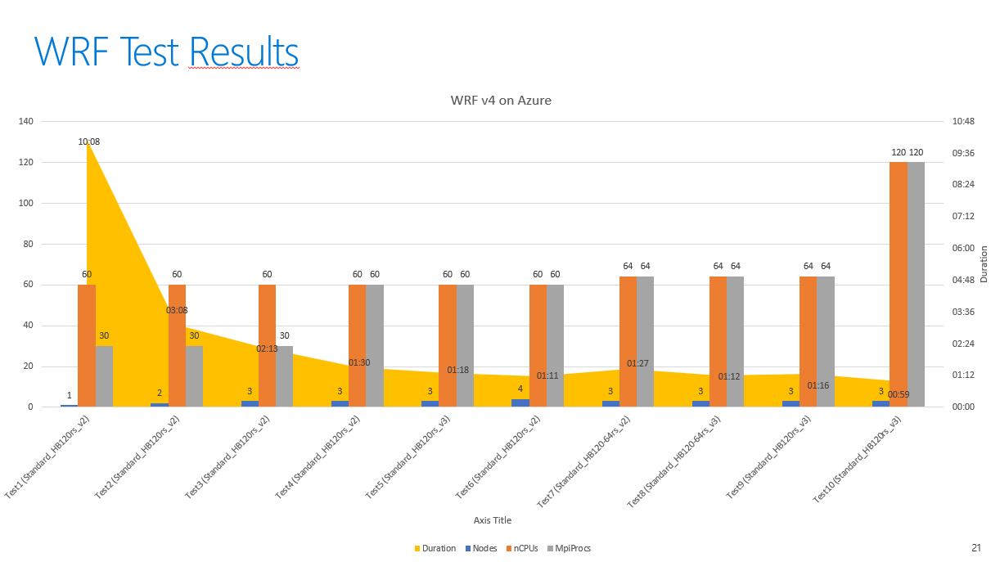

# Install and run WPS and WRF v4 - Setup guide
  
## Prerequisites

- You need a cluster built with the desired configuration for networking, storage, compute etc. You can use the tutorial in this repo with an end-to-end instructions to setup a lab environment on Cycle Cloud to run WPS and WRF v4. (See [Install and run WPS and WRF v4 - end-to-end setup guide](../../experimental/wrf_on_cyclecloud/readme.md) for details).   
- As this procedure uses HBv3 VMs to run WRFv4 simulations, you may need to request quota increase for this type of SKU in the subscription and region you will deploy the environment. You can use different SKU if you want to.
- You need to download/clone the azurehpc GitHub repository 
- This installation procedure requires you have 2 folders mounted /apps and /data on your storage solution

### Summary of steps:
-	Install WPS/WRF v4 software (from “azurehpc” scripts) 
-	Download data for WRF v4
-	Edit data locations in WRF config files
-	Generate WRF v4 input files, change permissions
-	Run WRF v4  applications for testing

### Install WPS/WRF v4 software (via “azurehpc” scripts)

Spin up and SSH to a Worker Node VM (HBv3). 

**Important 1**: You must have the /apps and /data volumes correctly mounted on head and worker nodes. It is required for WRF setup scripts.

**Important 2**: You need to be root user to run all commands below.

Be sure you have downloaded azurehpc GitHub repository in /data folder:
```
cd /data
git clone https://github.com/marcusgaspar/azurehpc.git
#git clone https://github.com/Azure/azurehpc.git
```

Then, run the following commands:
```
# need to be root user for building everything
sudo su -   

###### Setup Spack
cd /data/azurehpc/apps/spack
./build_spack.sh hbv3
source /apps/spack/0.16.3/spack/share/spack/setup-env.sh

###### Setup WRF
# MPI_TYPE : openmpi or mvapich2
# SKU_TYPE : hb, hbv2, hc, hbv3

# This procedure uses openmpi and hbv3
cd /data/azurehpc/apps/wrf/
./build_wrf.sh openmpi hbv3
./build_wps.sh openmpi hbv3
```

Run the command to source the env-variables file:
```
###### Source Variables
# Keep as root
#sudo su -
source /data/azurehpc/apps/wrf/env-variables hbv3
```

### Download WFR Input DATA (new_conus2.5km)
WPS (WRF preprocessing system) is used to create WRF input cases. WRF v3 models are not compatible with WRF v4, so some WRF v4 input cases will need to be generated with WPS v4.
I will outline the procedure used to create a new_conus2.5km input case for WRF v4.
 
References: 
- [azurehpc/apps/wrf](https://www2.mmm.ucar.edu/wrf/users/download/get_sources_wps_geog.html)
- [Static data downloads from ucar.edu](https://www2.mmm.ucar.edu/wrf/users/download/get_sources_wps_geog.html)

Run the commands below to download geopraphical static data for WPS v4:
```
# Keep as root
#sudo su -

mkdir /data/wrfdata
cd /data/wrfdata
git clone https://github.com/akirakyle/WRF_benchmarks.git
wget https://www2.mmm.ucar.edu/wrf/src/wps_files/topo_10m.tar.bz2
wget https://www2.mmm.ucar.edu/wrf/src/wps_files/topo_2m.tar.bz2
wget https://www2.mmm.ucar.edu/wrf/src/wps_files/topo_30s.tar.bz2
wget https://www2.mmm.ucar.edu/wrf/src/wps_files/albedo_modis.tar.bz2
wget https://www2.mmm.ucar.edu/wrf/src/wps_files/maxsnowalb_modis.tar.bz2
wget https://www2.mmm.ucar.edu/wrf/src/wps_files/topo_gmted2010_30s.tar.bz2
wget https://www2.mmm.ucar.edu/wrf/src/wps_files/modis_landuse_20class_30s_with_lakes.tar.bz2
wget https://www2.mmm.ucar.edu/wrf/src/wps_files/soiltemp_1deg.tar.bz2
wget https://www2.mmm.ucar.edu/wrf/src/wps_files/soiltype_top_30s.tar.bz2
wget https://www2.mmm.ucar.edu/wrf/src/wps_files/soiltype_bot_30s.tar.bz2
wget https://www2.mmm.ucar.edu/wrf/src/wps_files/greenfrac_fpar_modis.tar.bz2
wget https://www2.mmm.ucar.edu/wrf/src/wps_files/lai_modis_10m.tar.bz2
wget https://www2.mmm.ucar.edu/wrf/src/wps_files/orogwd_10m.tar.bz2

tar xjvf topo_10m.tar.bz2
tar xjvf topo_2m.tar.bz2
tar xjvf topo_30s.tar.bz2
tar xjvf albedo_modis.tar.bz2
tar xjvf maxsnowalb_modis.tar.bz2
tar xjvf topo_gmted2010_30s.tar.bz2
tar xjvf modis_landuse_20class_30s_with_lakes.tar.bz2
tar xjvf soiltemp_1deg.tar.bz2
tar xjvf soiltype_top_30s.tar.bz2
tar xjvf soiltype_bot_30s.tar.bz2
tar xjvf greenfrac_fpar_modis.tar.bz2
tar xjvf lai_modis_10m.tar.bz2
tar xjvf orogwd_10m.tar.bz2
```

Download the data from https://rda.ucar.edu/datasets/ds084.1/
1) Register to the site and go to the "Data Access" section and download the following data:
2) Data Access > Web File Listing > Complete File List > 2018 > 2018-06-17 
3) Select:  from gfs.0p25.2018061700.f000.grib2 to gfs.0p25.2018061712.f384.grib2 (93 files around 20GB)
4) Select Python Download Script and upload it to the worker VM as download_gfs_files.py.

Run the commands and be sure of copying the download_gfs_files.py the folder below:
```
# Keep as root
#sudo su -

mkdir /data/wrfdata/gfs_files
cd /data/wrfdata/gfs_files
python download_gfs_files.py <password used to register in rda site>
```

### Generate WRF4 Input Files
Modify your **namelist.wps** file, setting the correct paths for **geog_data_path**, **opt_geogrid_tbl_path** and **opt_metgrid_tbl_path**:
```
# Keep as root
#sudo su -

#### Change Data Locations
cd /apps/hbv3/wps-openmpi/WPS-4.1
cp namelist.wps namelist.wps.old
cp /data/wrfdata/WRF_benchmarks/cases/new_conus2.5km/namelist.wps namelist.wps

vi /apps/hbv3/wps-openmpi/WPS-4.1/namelist.wps
 geog_data_path = '/data/wrfdata/',
 opt_geogrid_tbl_path = '/apps/hbv3/wps-openmpi/WPS-4.1/geogrid/',
 opt_metgrid_tbl_path = '/apps/hbv3/wps-openmpi/WPS-4.1/metgrid/',
```

### Run Applications: 

#### Run geogrid.exe and metgrid.exe
```
# Keep as root
sudo su -

# Source variables
source /data/azurehpc/apps/wrf/env-variables hbv3

#### Run geogrid.exe 
cd /apps/hbv3/wps-openmpi/WPS-4.1/
mpirun --allow-run-as-root ./geogrid.exe
ln -s ungrib/Variable_Tables/Vtable.GFS Vtable
./link_grib.csh /data/wrfdata/gfs_files/gfs.0p25.20180617*
./ungrib.exe >& ungrib.log

#### Run metgrid.exe
mpirun --allow-run-as-root ./metgrid.exe
```

Expected results 1: 
``` 
# !  Successful completion of metgrid.  ! 
# You may receive also some warnings, which is expected: 
Note: The following floating-point exceptions are signalling: IEEE_OVERFLOW_FLAG IEEE_UNDERFLOW_FLAG IEEE_DENORMAL
``` 
Expected results 2: 
You will find the files below:
``` 
ls -l *met_em.d*
# Should see the following files:
# met_em.d01.2018-06-17_12:00:00.nc
# met_em.d01.2018-06-17_09:00:00.nc
# met_em.d01.2018-06-17_06:00:00.nc
# met_em.d01.2018-06-17_03:00:00.nc
# met_em.d01.2018-06-17_00:00:00.nc
```

#### Run real.exe
``` 
# Keep as root
sudo su -

cd /apps/hbv3/wrf-openmpi/WRF-4.1.5/run
cp -f namelist.input namelist.input.old
cp -f /data/wrfdata/WRF_benchmarks/cases/new_conus2.5km/namelist.input .
cp /apps/hbv3/wps-openmpi/WPS-4.1/met_em.d0*.nc .
mpirun --allow-run-as-root ./real.exe
```

Expected results: 
The following files should be generated in /apps/hbv3/wrf-openmpi/WRF-4.1.5/run/
- wrfbdy_d01
- wrfinput_d01
```
ls -l /apps/hbv3/wrf-openmpi/WRF-4.1.5/run/*_d0*
```

#### Change Permissions on Files
Grant permission to users that will run the WRF to access the files on /data and /apps. 
For my environment, I used "azureadmin" as CycleCloud admin. 
Change the user below accordingly.     

```
# grant permission to users that will run the WRF to access the files. 
chown -R <your admin user>:cyclecloud /data
chown -R <your admin user>:cyclecloud /apps
chmod -R g+w /data
chmod -R g+w /apps
```

**If you get here, you have completed the WRF v4 setup!**

Now you can shutdown and terminate the worker node (HBv3) used to perform these setup procedures.

## Running and Testing

Connect to head node of your cluster and submit WRF v4 simulation job:

> Where SKU_TYPE is the sku type you are running on and INPUTDIR contains the location of wrf input files (namelist.input, wrfbdy_d01 and wrfinput_d01)

- Test 1 
  - SKU: Standard_HB120rs_v2
  - Nodes: 1 
  - Processes per node: 60 
  - MPI processes per node: 30 
```
mkdir ~/test1
cd ~/test1

qsub -l select=1:nodearray=execute1:ncpus=60:mpiprocs=30,place=scatter:excl -v "SKU_TYPE=hbv3,INPUTDIR=/apps/hbv3/wrf-openmpi/WRF-4.1.5/run" /data/azurehpc/apps/wrf/run_wrf_openmpi.pbs
```

- Test 2 
  - SKU: Standard_HB120rs_v2
  - Nodes: **2** 
  - Processes per node: 60 
  - MPI processes per node: 30 
```
mkdir ~/test2
cd ~/test2

qsub -l select=2:nodearray=execute1:ncpus=60:mpiprocs=30,place=scatter:excl -v "SKU_TYPE=hbv3,INPUTDIR=/apps/hbv3/wrf-openmpi/WRF-4.1.5/run" /data/azurehpc/apps/wrf/run_wrf_openmpi.pbs
```

- Test 3 
  - SKU: Standard_HB120rs_v2
  - Nodes: **3** 
  - Processes per node: 60 
  - MPI processes per node: 30 
```
mkdir ~/test3
cd ~/test3

qsub -l select=3:nodearray=execute1:ncpus=60:mpiprocs=30,place=scatter:excl -v "SKU_TYPE=hbv3,INPUTDIR=/apps/hbv3/wrf-openmpi/WRF-4.1.5/run" /data/azurehpc/apps/wrf/run_wrf_openmpi.pbs
```

- Test 4
  - SKU: Standard_HB120rs_v2
  - Nodes: 3
  - Processes per node: 60 
  - MPI processes per node: **60**
```
mkdir ~/test4
cd ~/test4

qsub -l select=3:nodearray=execute1:ncpus=60:mpiprocs=60,place=scatter:excl -v "SKU_TYPE=hbv3,INPUTDIR=/apps/hbv3/wrf-openmpi/WRF-4.1.5/run" /data/azurehpc/apps/wrf/run_wrf_openmpi.pbs
```

- Test 5
  - SKU: **Standard_HB120rs_v3**
  - Nodes: 3 
  - Processes per node: 60 
  - MPI processes per node: 60 
```
mkdir ~/test5
cd ~/test5

qsub -l select=3:nodearray=execute1:ncpus=60:mpiprocs=60,place=scatter:excl -v "SKU_TYPE=hbv3,INPUTDIR=/apps/hbv3/wrf-openmpi/WRF-4.1.5/run" /data/azurehpc/apps/wrf/run_wrf_openmpi.pbs
```

- Test 6
  - SKU: **Standard_HB120rs_v2**
  - Nodes: **4** 
  - Processes per node: 60 
  - MPI processes per node: 60 
```
mkdir ~/test6
cd ~/test6

qsub -l select=4:nodearray=execute1:ncpus=60:mpiprocs=60,place=scatter:excl -v "SKU_TYPE=hbv3,INPUTDIR=/apps/hbv3/wrf-openmpi/WRF-4.1.5/run" /data/azurehpc/apps/wrf/run_wrf_openmpi.pbs
```

- Test 7
  - SKU: **Standard_HB120-64rs_v2**
  - Nodes: **3** 
  - Processes per node: **64** 
  - MPI processes per node: **64** 
```
mkdir ~/test7
cd ~/test7

qsub -l select=3:nodearray=execute1:ncpus=64:mpiprocs=64,place=scatter:excl -v "SKU_TYPE=hbv3,INPUTDIR=/apps/hbv3/wrf-openmpi/WRF-4.1.5/run" /data/azurehpc/apps/wrf/run_wrf_openmpi.pbs
```

- Test 8
  - SKU: **Standard_HB120-64rs_v3**
  - Nodes: 3 
  - Processes per node: 64 
  - MPI processes per node: 64
```
mkdir ~/test8
cd ~/test8

qsub -l select=3:nodearray=execute1:ncpus=64:mpiprocs=64,place=scatter:excl -v "SKU_TYPE=hbv3,INPUTDIR=/apps/hbv3/wrf-openmpi/WRF-4.1.5/run" /data/azurehpc/apps/wrf/run_wrf_openmpi.pbs
```

- Test 9
  - SKU: **Standard_HB120rs_v3**
  - Nodes: 3 
  - Processes per node: 64 
  - MPI processes per node: 64 
```
mkdir ~/test9
cd ~/test9

qsub -l select=3:nodearray=execute1:ncpus=64:mpiprocs=64,place=scatter:excl -v "SKU_TYPE=hbv3,INPUTDIR=/apps/hbv3/wrf-openmpi/WRF-4.1.5/run" /data/azurehpc/apps/wrf/run_wrf_openmpi.pbs
```

- Test 10
  - SKU: Standard_HB120rs_v3
  - Nodes: 3 
  - Processes per node: **120** 
  - MPI processes per node: **120**
```
mkdir ~/test10
cd ~/test10

qsub -l select=3:nodearray=execute1:ncpus=120:mpiprocs=120,place=scatter:excl -v "SKU_TYPE=hbv3,INPUTDIR=/apps/hbv3/wrf-openmpi/WRF-4.1.5/run" /data/azurehpc/apps/wrf/run_wrf_openmpi.pbs
```

### Test Results
In the graph below you can compare the execution time from tests performed, with different number of nodes, cores, mpicores and SKUs:



### Validate Job Status
To validate the status of the job submission, you can use:
```
# check jobs history
qstat -x

# check jobs history showing the wall clock duration
qstat -xG

# check jobs history showing the execution details 
qstat -xf
```


