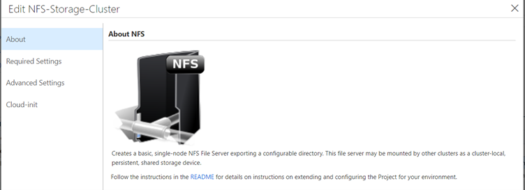
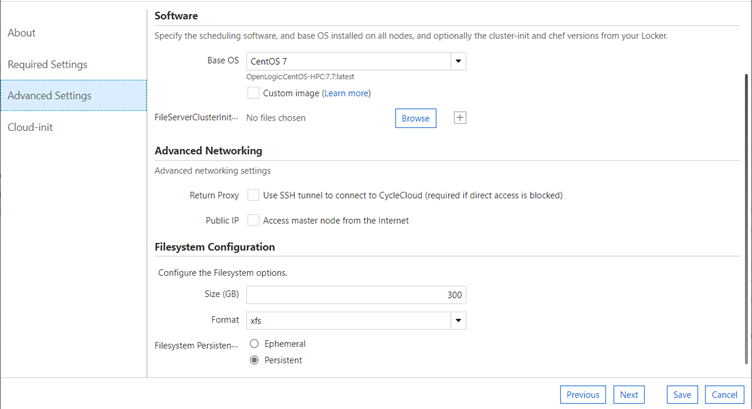
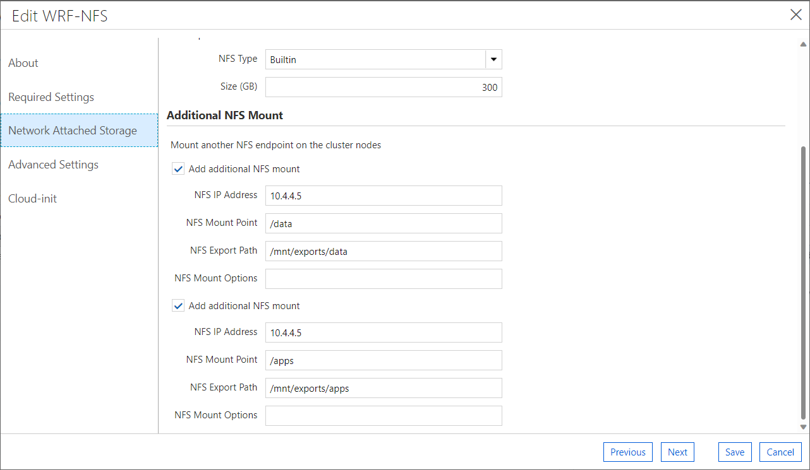
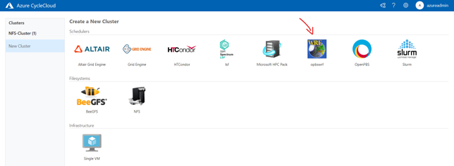
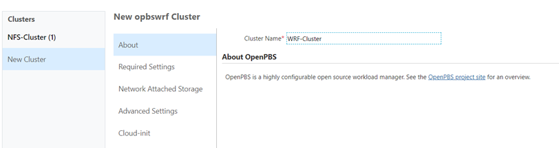
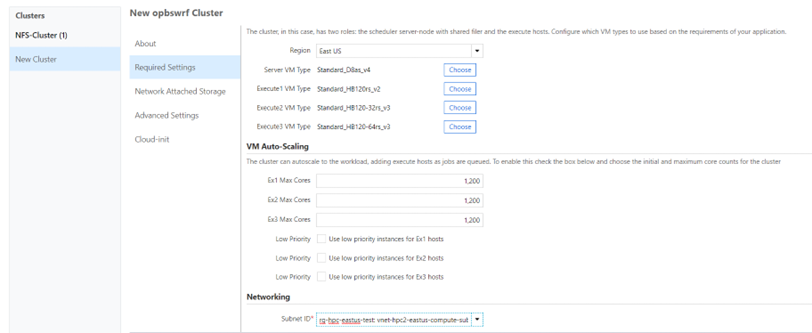
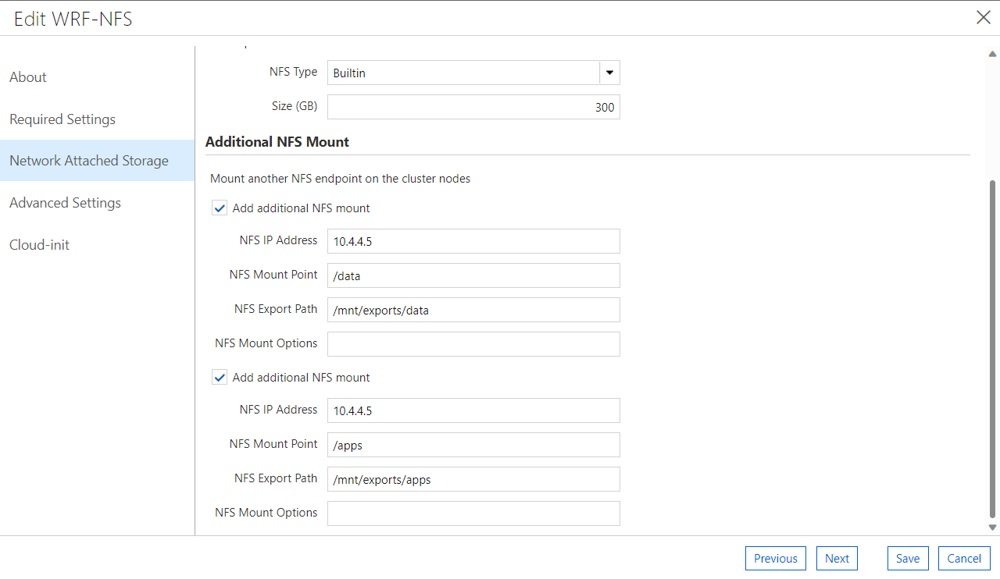
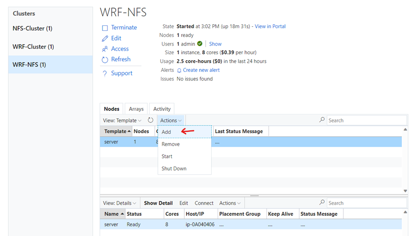
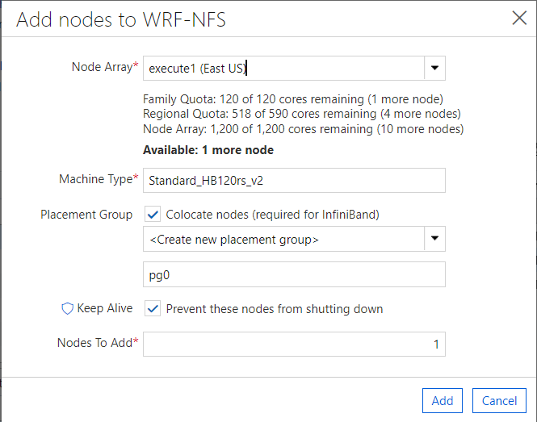

# Install and run WRF v4 and WPS v4 - End-to-end Setup guide for a Lab environment using Cycle Cloud

Summary of this procedure:
- Installs CycleCloud Lab environment from scratch
- Creates NFS storage server using CycleCloud cluster template
- Installs WPS/WRF v4 software (via “azurehpc” scripts)
  
## Prerequisites
- As this procedure uses HBv2 VMs to run WRFv4 simulations, you may need to request quota increase for this type of SKU in the subscription and region you will deploy the environment. 


## Install Azure CycleCloud Lab environment
Follow the steps to [Install and Setup CycleCloud Lab Environment](../../tutorials/cyclecloud/install-cyclecloud.md) from scratch.
 
 
## Create NFS Storage cluster
- It can be possible to include an external NFS share at this point (in the example, I have shared from an NFS cluster using on CycleCloud template)
- As this procedure is for a lab environment we are creating a NFS storage cluster, using the standard template in Cycle Cloud. For production environments, you could use a high performance storage solutions, such as  Azure NetApp Files (ANF), for instance.






Changes:
- Change OS to use CentOS 7 versions
- Use +300GB storage size (space to download WRF data)
- Change cloud-init as following:
- Confirm the IP address of your NFS storage and change it below accordingly:

```
#!/bin/bash

set -x
yum install -y epel-release
yum install -y Lmod at
systemctl enable --now atd.service
cat <<EOF>/mnt/exportfs.sh
#!/bin/bash
set -x
mkdir -p /mnt/exports/data /mnt/exports/apps
sudo exportfs -o rw,sync,no_root_squash 10.4.0.0/20:/mnt/exports/data
sudo exportfs -o rw,sync,no_root_squash 10.4.0.0/20:/mnt/exports/apps
EOF
chmod 755 /mnt/exportfs.sh
at now + 2 minute -f /mnt/exportfs.sh
```

Connect to NFS storage cluster and check the mounts are correct:
```
# check mount
sudo exportfs -s
```

## Setup WRF cluster using HBv2 VM
Summary of steps:
-	Import WRF cluster template (from “azurehpc” scripts) 
-	Start WRF cluster using HBv2 VM 
-	Install WPS/WRF v4 software (from “azurehpc” scripts) 


### Import custom CycleCloud template for WRF

- Start NFS storage cluster

- SSH to it and download azurehpc GitHub repository to the /data folder. 
```
## Download azurehpc GitHub repository
cd /data
git clone https://github.com/Azure/azurehpc.git
```

Follow the procedures [here](https://docs.microsoft.com/en-us/azure/cyclecloud/tutorials/modify-cluster-template?view=cyclecloud-8#import-the-new-cluster-template) to upload the Cycle Cloud custom template created for WRF.
Use the template: [opbswrf-template.txt](opbswrf-template.txt) 
```
## Import CycleCloud template
cd /data/azurehpc/apps/wrf/
cyclecloud import_template opbswrf -f opbswrf-template.txt --force
``` 
After you import the template, you will see the WRF template in CycleCloud Portal:



### Create new WRF cluster
Choose the WRF Cluster name:


Choose the SKUs you want use for testing and the subnet for the compute VMs:


Check **Additional NFS Mount** options and change to the correct NFS IP address, related to your environment. Don’t need to change NFS Mount Point and NFS Export Path


Keep the default value for the other parameters, save it and start the cluster.

### Spin Execute Node with HBv2
After the cluster is up and running, start a worker node using HBv2 VM:


Click Add.

### Install WPS/WRF v4 software (via “azurehpc” scripts)

Now you have a WRF cluster properly configured and running in Cycle Cloud. 

You can follow the instructions here to finish the WPS/WRF installation: [Install and run WPS and WRF v4 - Setup guide](../../wrf/../README.md) 

