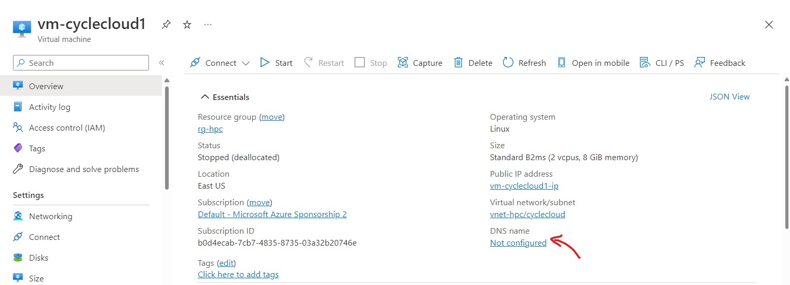
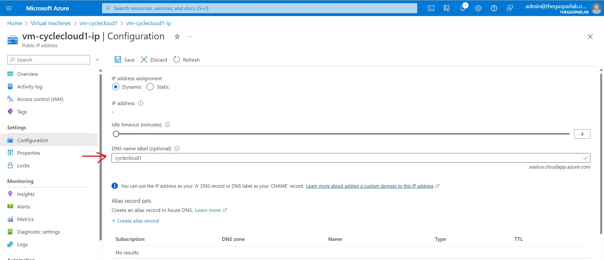

# Install and Setup CycleCloud for a Lab environment

Before you start, define which **Subscription**, **Resource Group**, **Region** and **Virtual Network** you will use to deploy your CycleCloud environment. 

##1. Create VNET
Here we are creating a new Virtual Network for the CycleCloud environment. For this basic setup, we are using only CycleCloud and Compute subnets. But use can create all subnets in the scripts for future advanced scenarios.
Change the variables values if you want to or use the default ones.
```
##################################################
# Variables
##################################################
Location="southcentralus"
RG_VNET="rg-wrf-poc-$Location"

# VNET HPC 
VNET_NAME="vnet-wrf-poc-$Location"
SUBNET_NAME_CYCLECLOUD="cyclecloud-subnet"
SUBNET_NAME_USER="user-subnet"
SUBNET_NAME_COMPUTE="compute-subnet"
SUBNET_NAME_ANF="anf-subnet"
SUBNET_NAME_VISUALIZATION="visualization-subnet"

# IP ranges
VNET_NAME_CIDR="10.4.0.0/20"
SUBNET_NAME_CYCLECLOUD_CIDR="10.4.0.0/28" 
SUBNET_NAME_USER_CIDR="10.4.2.0/24" 
SUBNET_NAME_COMPUTE_CIDR="10.4.4.0/22"
SUBNET_NAME_VISUALIZATION_CIDR="10.4.1.0/25"
SUBNET_NAME_ANF_CIDR="10.4.0.16/28"
##################################################

# Create resource Group
az group create --name $RG_VNET --location $Location

# Create VNET
az network vnet create --resource-group $RG_VNET --name $VNET_NAME --location $Location \
    --address-prefixes $VNET_NAME_CIDR 

# Create Subnets
az network vnet subnet create --address-prefix $SUBNET_NAME_CYCLECLOUD_CIDR --name $SUBNET_NAME_CYCLECLOUD \
    --resource-group $RG_VNET --vnet-name $VNET_NAME

az network vnet subnet create --address-prefix $SUBNET_NAME_USER_CIDR --name $SUBNET_NAME_USER \
    --resource-group $RG_VNET --vnet-name $VNET_NAME

az network vnet subnet create --address-prefix $SUBNET_NAME_COMPUTE_CIDR --name $SUBNET_NAME_COMPUTE \
    --resource-group $RG_VNET --vnet-name $VNET_NAME

az network vnet subnet create --address-prefix $SUBNET_NAME_ANF_CIDR --name $SUBNET_NAME_ANF \
    --resource-group $RG_VNET --vnet-name $VNET_NAME --delegations "Microsoft.NetApp/volumes"

az network vnet subnet create --address-prefix $SUBNET_NAME_VISUALIZATION_CIDR --name $SUBNET_NAME_VISUALIZATION \
    --resource-group $RG_VNET --vnet-name $VNET_NAME
```

##2. Create CycleCloud from Portal 

CycleCloud can be installed via Azure Marketplace, see [Quickstart - Install via Marketplace - Azure CycleCloud | Microsoft Docs](https://learn.microsoft.com/en-us/azure/cyclecloud/qs-install-marketplace?view=cyclecloud-8):
1. Choose your subscription from the Subscription dropdown
2. Select or create a new Resource Group that your CycleCloud instance will run in.
3. Name your CycleCloud instance using Virtual Machine name
4. Select the Region
5. Create the Username that you will use to log into the instance
6. Add or create your SSH public key
7. If you are planning on using [Managed Identities](https://learn.microsoft.com/en-us/azure/active-directory/managed-identities-azure-resources/overview) (recommended), Select the Management tab and enable System assigned managed identity.
8. Click on the Review button and then the Create button

##3. Assign Contributor role on the subscription to managed-identity 
From Azure Portal, go to Subscriptions and assign Contributor role to the CycleCloud VM managed Identity (Subscription > Access control (IAM) > Add > Add role assignment).
>You need to have **Owner** permission on the Subscription 

##4. Configure DNS name label for public IP (optional)
You can define a DNS Name for the CycleCloud VM public IP, it can facilitate the access to the VM. 
Go to CycleCloud VM and click in DNS Name:


Add a DNS Name and save:


##4. Create storage account
Cyclecloud requires a storage account for [locker access](https://learn.microsoft.com/en-us/azure/cyclecloud/how-to/storage-blobs?view=cyclecloud-8). 
Create storage account from the Azure Portal: 
- Select the Subscription, Resource Group, Region you defined previously. 
- Define a **Name**, set **Performance** as Standard, **Redundancy** as LRS. 
- Keep all other settings with default values and create it.

##6. Setup CycleCloud portal
- Open the browser and access the CycleCloud Portal using the DNS Label created above or the public IP of the CycleCloud VM.
- Follow the steps described [here](https://learn.microsoft.com/en-us/azure/cyclecloud/qs-install-marketplace?view=cyclecloud-8#log-into-the-cyclecloud-application-server)

##7. Import Cluster Template